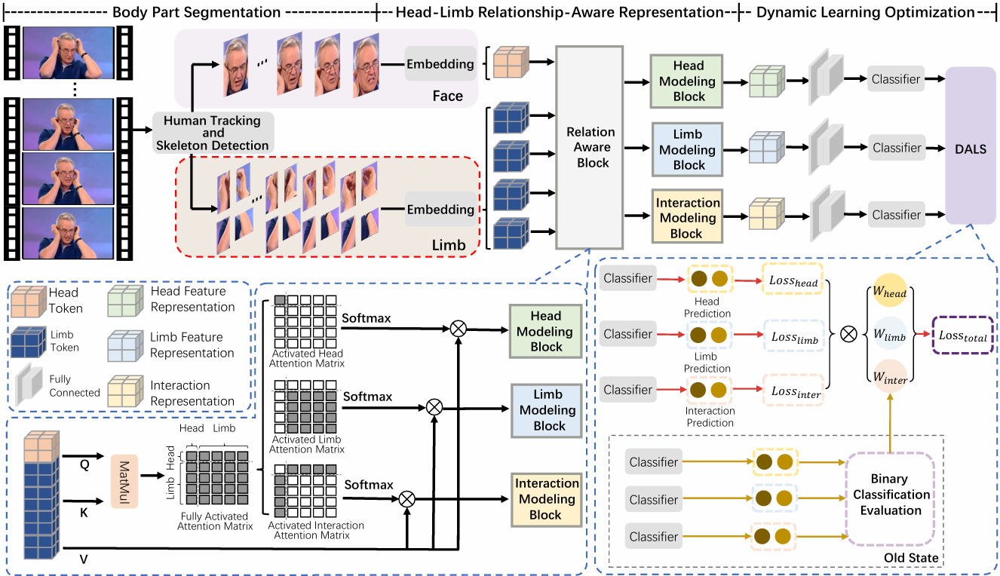

---

# 🎭 Detecting Deceptive Behavior via Learning Relation-Aware Visual Representations (DLF-BRAM)

---

## 🌟 Abstract

With the rapid development and widespread adoption of digital media, deceptive behavior has become an increasingly urgent issue, demanding efficient and robust detection techniques. While most current visual deception detection methods focus on facial expressions, psychological studies show that deception often manifests in subtle inconsistencies between body regions, such as the head and limbs.

We propose a **Dynamic Learning Framework with Body part Relationship-Aware Modeling (DLF-BRAM)** that explicitly models interactions between the head and limbs. The framework consists of two key components:

* **HLRAR (Head-Limb Relationship-Aware Representation)** module: models the spatiotemporal relationships between the head and limbs to extract discriminative cues;
* **DALS (Dynamic Assessment Learning Strategy)**: dynamically evaluates the learning effectiveness of each branch and adjusts their weights to avoid overfitting to a single cue.

Extensive experiments on public datasets show that DLF-BRAM outperforms existing methods and demonstrates strong generalization capability.

---

## 🧭 Main Diagram



---

## 📁 Project Structure

```
DLF_BRAM/
├── main.py                  # Main training/testing script
├── models/
│   └── DLF_BRAM.py          # Model definition
├── datasets/
│   └── mydataloader.py      # Dataset loader with key block extraction
├── checkpoints/             # Model saving directory
├── data/                    # Dataset (frames and annotations)
├── log/                     # Training logs
├── requirements.txt         # Dependencies
└── README.md                # This file
```

---

## 🔧 Environment Setup

We recommend using Python 3.7:

```bash
conda create -n DLF python=3.7
conda activate DLF
pip install -r requirements.txt
```

---

## 🚀 Quick Start

### 1. Data Preparation

Make sure your data is organized like this (example: `Dolos` dataset):

```
data/
└── Dolos/
    ├── frames/              # Subfolder for each video with image frames
    └── keyblock7head/       # JSON annotations per frame (body parts); format see in utils.image_crop.py
    # preprocess by Alphapose
```

### 2. Train the Model

```bash
python main.py \
  --data_name Dolos \
  --train_flag 1 \
  --len 4 \
  --blocks 5 \
  --depth 4 \
  --size 96 \
  --batch_size 32 \
  --lr 1e-6 \
  --num_epochs 100 \
  --device cuda:0
```

### 3. Test with Pretrained Model

```bash
python main.py \
  --data_name Dolos \
  --train_flag 1 \
  --len 4 \
  --blocks 5 \
  --depth 4 \
  --size 96 \
  --batch_size 32 \
  --test \
  --pretrained_path ./checkpoints/Dolos_1_DLF_BRAM_4_5/bestepoch.pth
```

---

## 🧠 Model Highlights

* ✅ Multi-branch architecture modeling head-limb relationships;
* ✅ Dynamic weight tuning via DALS to ensure balanced learning;
* ✅ Region-specific processing to reduce background noise.

---

## 📚 Citation

If you use this project in your research, please cite:

> *Zhu et al., "Detecting Deceptive Behavior via Learning Relation-Aware Visual Representations", IEEE TIFS 2025 (Under Review).*

---

## 📬 Contact

Feel free to contact us for collaboration or questions:

```
dongliangzhu@whz.edu.cn
zhangchi_@stu.xidian.edu.cn
```

---
